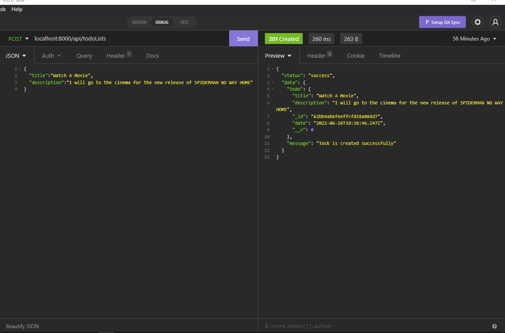
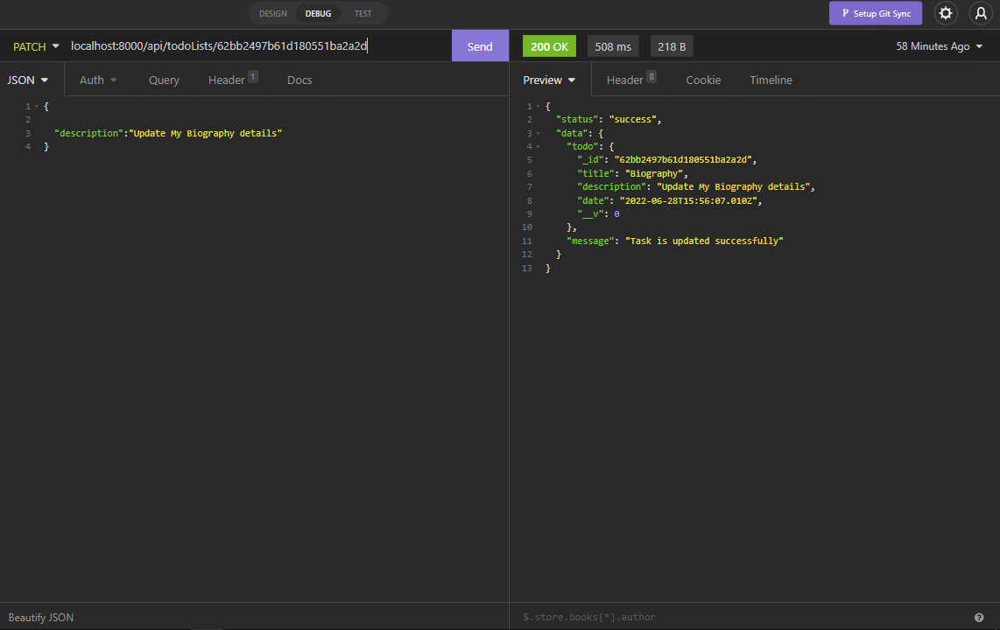
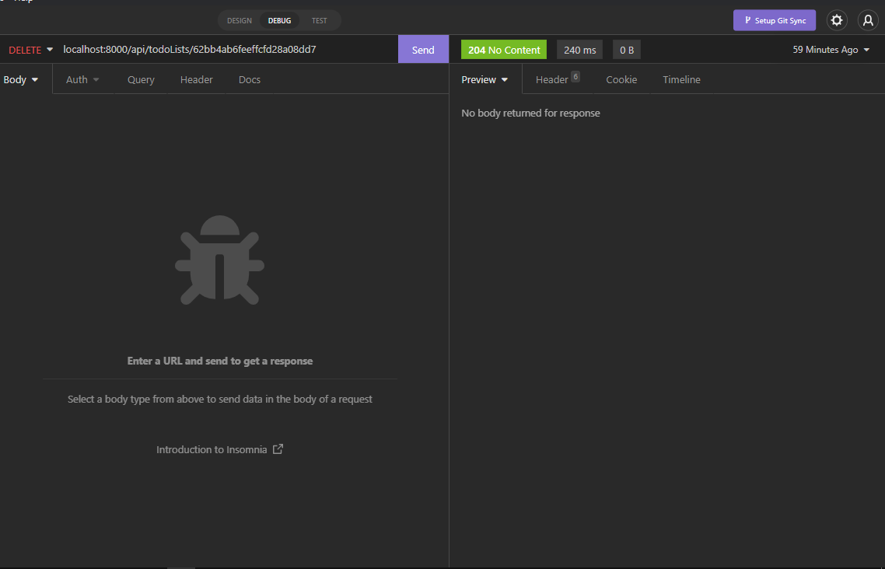
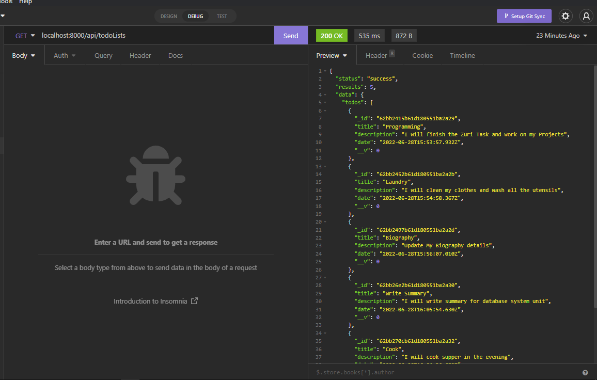
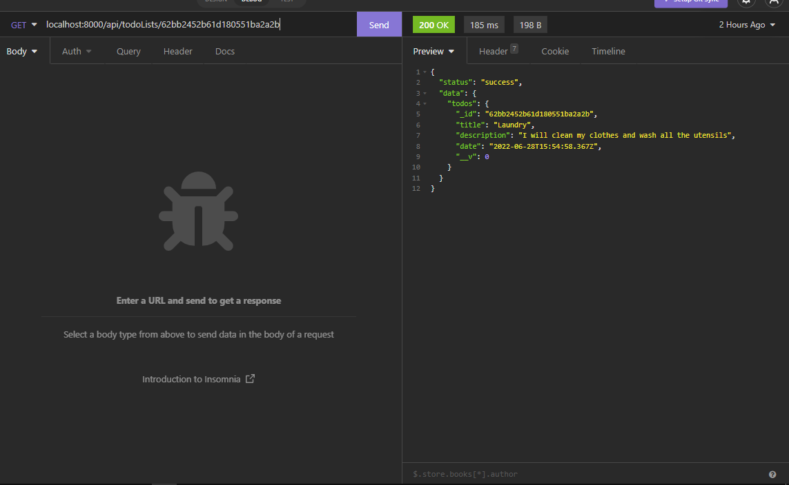

#  **MongoDB CRUD OPERATIONS**
## This is a `NodeJS` task that uses express server to create a `TODO Task API Application`
### API uses `CRUD` operations to do the following Tasks
1. Add a Todo task to a Todo collection
2. Update a particular Todo task
3. Delete Todo task
4. Retrieve all Todo tasks

### `Todo` documents in the MongoDB contains the following fields;
- `_id`
- `title`
- `description`
- `timestamp`

---------
## Below are screenshots of the API outputs from different endpoints

- ## Post method `Adding/Creating a ToDO task`

- ## Patch method `Updating a ToDO task`

- ## Delete method `Deleting a ToDO task`

- ## Get method `Retrieving all ToDO tasks`

- ## Get method `Retrieving a single ToDO task`
